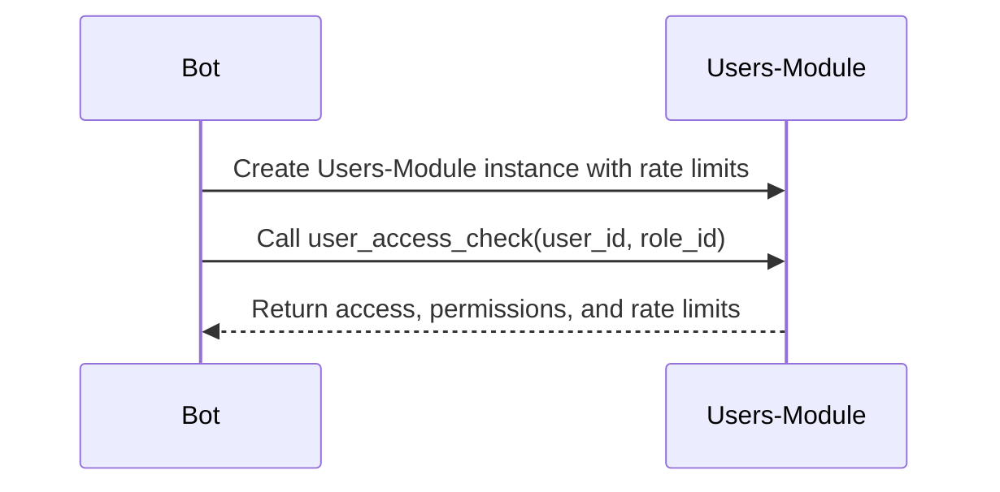

# Users Package
[](https://github.com/obervinov/users-package/actions/workflows/release.yaml)
[](https://github.com/obervinov/users-package/actions/workflows/github-code-scanning/codeql)
[](https://github.com/obervinov/users-package/actions/workflows/pr.yaml)


##  About this project
**Project Description**

This Python module is designed to simplify user management in __Telegram Bots__ by providing necessary functionality such as: `authentication`, `authorization` and `request limitation`, providing efficient management of user attributes and access rights.

Interaction Model 1: Using a Unified Entrypoint (Method: `user_access_check()`)


**Key Features**

- This module is designed primarily for Telegram bots but can be adapted for various projects that require user management, role-based access control, and request rate limiting.

- This module requires certain dependencies related to
    - [Vault](https://www.vaultproject.io)
      - [Vault Server](docker-compose.ymla) for storing user configurations and historical data
      - [Additional Module](https://github.com/obervinov/vault-package ) to interact with the Vault API
      - [Vault Policy](tests/vault/policy.hcl) with access rights to the Vault Server
    - [PostgreSQL](https://www.postgresql.org)
      - [PostgreSQL Server](docker-compose.yml) for storing user data and historical records
      - [PostgreSQL Schema](tests/postgres/tables.sql) for creating tables in the database

##  Description of module Constants

This module contains constant values

| Constant Name             | Description                                       | Default Value           |
|---------------------------|---------------------------------------------------|-------------------------|
| `USERS_VAULT_CONFIG_PATH` | Path for configuration data in Vault.             | `"configuration/users"` |
| `USER_STATUS_ALLOW`       | User access status for allowed access.            | `"allowed"`             |
| `USER_STATUS_DENY`        | User access status for denied access.             | `"denied"`              |


##  Description of module Exceptions
| Exception                    | Describe                              | Tips |
|------------------------------|---------------------------------------|------|
| `WrongUserConfiguration`     | Raised when user configuration is wrong. | Please, see the configuration [example](#-structure-of-configuration-and-statistics-data-in-vault) |
| `VaultInstanceNotSet`        | Raised when the Vault instance is not set. | Please, see [documentation](#class-initialization) |
| `FailedDeterminateRateLimit` | Raised when the rate limit cannot be determined. | Please, check misconfiguration between configuration and users requests in PostgreSQL |
| `StorageInstanceNotSet`      | Raised when the storage instance (PostgreSQL) is not set. | Please, see [documentation](#class-initialization) |
| `FailedStorageConnection`    | Raised when the connection to the storage (PostgreSQL) failed. | Please, check the connection to the PostgreSQL server |


##  Users class
### Class Initialization

The `Users` class provides authentication, authorization, user attribute management and user request logging for Telegram bots. You can initialize it with different options

- `vault (any)`: Configuration for initializing the Vault client.
  - `(VaultClient)`: an already initialized instance for interacting with the Vault API.
  - `(dict)`: configuration for initializing a VaultClient instance in this class.

- `rate_limits (bool)`: Enable rate limit functionality.

- `storage (dict)`: Configuration for initializing the storage client.
  - `db_role (str)`: The role name for the Vault database engine.

- **Examples:**

  - Initialize with `VaultClient` and without `rate_limits`:
    ```python
    users_without_ratelimits = Users(vault=vault_client, rate_limits=False, storage_connection=psycopg2.connect(**db_config))
    ```

  - Initialize with `VaultClient` and with `rate_limits`:
    ```python
    users_with_ratelimits = Users(vault=vault_client, storage_connection=psycopg2.connect(**db_config))
    ```

  - Initialize with Vault `configuration dictionary`:
    ```python
    vault_config = {
      'namespace': 'my_project',
      'url': 'https://vault.example.com',
      'auth': {
          'type': 'approle',
          'role_id': 'my_role_id',
          'secret_id': 'my_secret_id'
      }
    }
    users_with_dict_vault = Users(vault=vault_config, storage_connection=psycopg2.connect(**db_config))
    ```

### method: User Access Check

The `user_access_check()` method is the main entry point for authentication, authorization, and request rate limit verification. It is used to control the request rate (limits) for a specific user.

- **Arguments:**
  - `user_id (str)`: Required user ID.
  - `role_id (str)`: Required role ID for the specified user ID.

- **Keyword Arguments:**
  - `chat_id (str)`: Required chat ID for the specified user ID. Additional context for logging.
  - `message_id (str)`: Required message ID for the specified user ID. Additional context for logging.

- **Examples:**
  ```python
  user_access_check(user_id='user1', role_id='admin_role', chat_id='chat1', message_id='msg1')
  ```

- **Returns:**
  - A dictionary with access status, permissions, and rate limit information.
    ```python
    {
      'access': self.user_status_allow / self.user_status_deny,
      'permissions': self.user_status_allow / self.user_status_deny,
      'rate_limits': '2023-08-06 11:47:09.440933' / None
    }
    ```

### Description of class attributes
| Data Type | Attribute           | Purpose                                                      | Default Value           |
|-----------|---------------------|--------------------------------------------------------------|-------------------------|
| `object`  | `vault`             | Vault instance for interacting with the Vault API.           | `None`                  |
| `dict`    | `storage`           | Configuration for initializing the storage client.           | `None`                  |
| `bool`    | `rate_limits`       | Enable request rate limit functionality.                     | `True`                  |
| `str`     | `user_status_allow` | User access status: allowed.                                 | `"allowed"`             |
| `str`     | `user_status_deny`  | User access status: denied.                                  | `"denied"`              |
| `str`     | `vault_config_path` | The prefix of the configuration path in the Vault.           | `"configuration/users"` |


##  RateLimiter class
### Class Initialization

The `RateLimiter` class provides restriction functionality for user requests to the Telegram bot in the context of a specific user.

- `vault (VaultClient)`: An already initialized instance for interacting with the Vault API or a configuration dictionary for initializing a VaultClient instance in this class.

- storage (Storage): An already initialized instance for interacting with the storage (PostgreSQL) or a configuration dictionary for initializing a Storage instance in this class.

- `user_id (str)`: User ID for checking speed limits.

- **Examples:**
  ```python
  limiter = RateLimiter(vault=vault_client, storage=storage_client, user_id='User1')
  ```

### method: Rate Limit Determination

The `determine_rate_limit()` method is the main entry point for checking bot request limits for the specified user. It returns information about whether the request rate limits are active and when they expire 

- **Examples:**
  ```python
  determine_rate_limit()
  ```

- **Returns:**
  - String with a `timestamp` of the end of restrictions on requests or `None` if rate limit is not applied.
    ```python
    ("2023-08-07 10:39:00.000000" | None)
    ```

### method: Get User Requests Counters

The `get_user_request_counters()` method calculates the number of requests made by the user and returns the number of requests per day and per hour.

- **Examples:**
  ```python
  get_user_request_counters()
  ```

- **Returns:**
  - A dictionary with the number of requests per day and per hour.
    ```python
    {
      'requests_per_day': 9,
      'requests_per_hour': 1
    }
    ```

### Description of Class Attributes
| Data Type      | Attribute                | Purpose                                                                  | Default Value                   |
|----------------|--------------------------|--------------------------------------------------------------------------|---------------------------------|
| `VaultClient`  | `vault`                  | Vault instance for interacting with the Vault API.                       | `None`                          |
| `Storage`      | `storage`                | Storage instance for interacting with the storage (PostgreSQL).          | `None`                          |
| `str`          | `user_id`                | User ID for checking speed limits.                                       | `None`                          |
| `str`          | `vault_config_path`      | The prefix of the configuration path in the Vault.                       | `"configuration/users"`         |
| `dict`         | `requests_configuration` | User request limits configuration.                                       | `None`                          |
| `dict`         | `requests_counters`      | Counters for the number of requests per day and per hour.                | `None`                          |


##  Structure of configuration in Vault
This project uses a Vault server with the KV2 engine and Database Engine for storing user configurations and database connection data.
It supports user configurations to define system access rights, roles, and request restrictions.

### Users Configuration
- **path to the secret**: `configuration/users/{user_id}`
- **keys and Values**:
  - `status`: The status of user access, which can be either
      - `self.user_status_allow`
      - `self.user_status_deny`
  - `roles`: A list of roles associated with the user ID, e.g., `["role1", "role2"]`.
  - `requests`: Limits on the number of requests
      - `requests_per_day`
      - `requests_per_hour`
      - `random_shift_time` (additional, random shift in minutes from 0 to the specified number) in minutes

- **example of a secret with configuration**:
```json
{
  "status": "allowed",
  "roles": ["admin_role", "additional_role"],
  "requests": {
    "requests_per_day": 10,
    "requests_per_hour": 1,
    "random_shift_minutes": 15
  }
}
```

### Database Configuration
- **path to the secret**: `configuration/database`

- **keys and values**:
  - `host`: The host of the PostgreSQL server.
  - `port`: The port of the PostgreSQL server.
  - `database`: The name of the PostgreSQL database.
  - `user`: The username for the PostgreSQL database.
  - `password`: The password for the PostgreSQL database.

  ```json
  {
    "host": "localhost",
    "port": 5432,
    "database": "mydatabase",
    "user": "myuser",
    "password": "mypassword",
  }
  ```


##  Structure of historical data in PostgreSQL
This project uses a PostgreSQL database to store historical data about user requests and access events. It supports user request logging to track user activity and access rights.
The detailed table schema can be found in this [sql file](tests/postgres/tables.sql).

### Users Requests Table
Contains records of user requests, access permission, access level, and apply limits on the number of requests.

### Users Table
Contains records of user metadata for the Telegram bot, such as user ID, chat ID, and message ID.

##  Additional usage example
Example 1 - With Rate Limits
```python
# import modules
from vault import VaultClient
from users import Users

# create the vault client
vault_client = VaultClient(
  url='http://0.0.0.0:8200',
  namespace='my_project',
  auth={
      'type': 'approle',
      'role_id': 'my_role',
      'secret_id': 'my_secret_id'
  }
)

# create the Users instance of the class with rate limits and get user information
users = Users(vault=vault_client, rate_limits=True, storage_connection=psycopg2.connect(**db_config))
user_info = users.user_access_check(user_id=message.chat.id, role_id="admin_role", chat_id=message.chat.id, message_id=message.message_id)

# check permissions, roles, and rate limits
if user_info["access"] == users.user_status_allow:
    print("Hi, you can use the bot!")
    if user_info["permissions"] == users.user_status_allow:
        if user_info["rate_limits"]:
            print(f"You have sent too many requests, the limit is applied until {user_info['rate_limits']}")
        else:
            print("You have admin's rights")
    else:
        print("You do not have access rights to this function")
else:
    print("Access denied, goodbye!")
```

Example 2 - Without Rate Limits
```python
# import modules
from vault import VaultClient
from users import Users

# create the vault client
vault_client = VaultClient(
  url='http://vault.example.com',
  namespace='my_project',
  auth={
      'type': 'approle',
      'role_id': 'my_role',
      'secret_id': 'my_secret_id'
  }
)

# create the Users instance of the class without rate limits and get user information
users = Users(vault=vault_client, storage_connection=psycopg2.connect(**db_config))
user_info = users.user_access_check(user_id=message.chat.id, role_id="admin_role", chat_id=message.chat.id, message_id=message.message_id)

# check permissions and roles
if user_info["access"] == users.user_status_allow:
    print("Hi, you can use the bot!")
    if user_info["permissions"] == users.user_status_allow:
        print("You have admin's rights")
    else:
        print("You do not have access rights to this function")
else:
    print("Access denied, goodbye!")
```

##  Installing
```bash
tee -a pyproject.toml <<EOF
[tool.poetry]
name = myproject"
version = "1.0.0"
description = ""

[tool.poetry.dependencies]
python = "^3.12"
users = { git = "https://github.com/obervinov/users-package.git", tag = "v4.0.0" }

[build-system]
requires = ["poetry-core"]
build-backend = "poetry.core.masonry.api"
EOF

poetry install
```

##  GitHub Actions
| Name  | Version |
| ------------------------ | ----------- |
| GitHub Actions Templates | [v2.0.2](https://github.com/obervinov/_templates/tree/v2.0.2) |