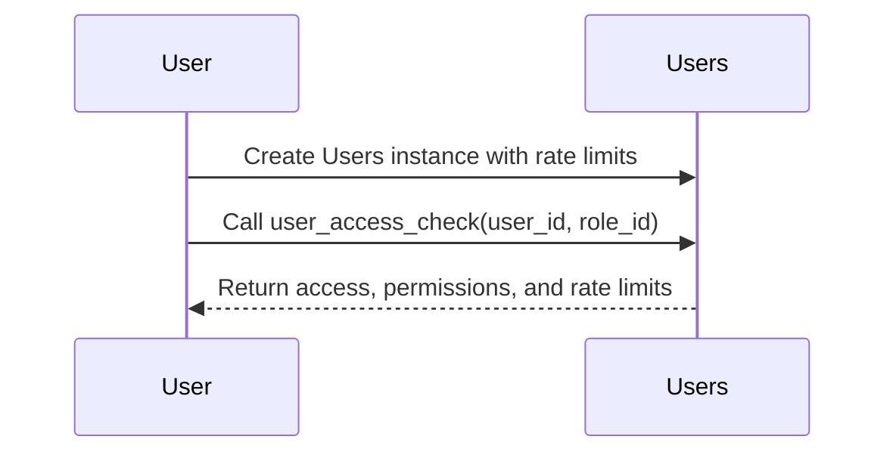
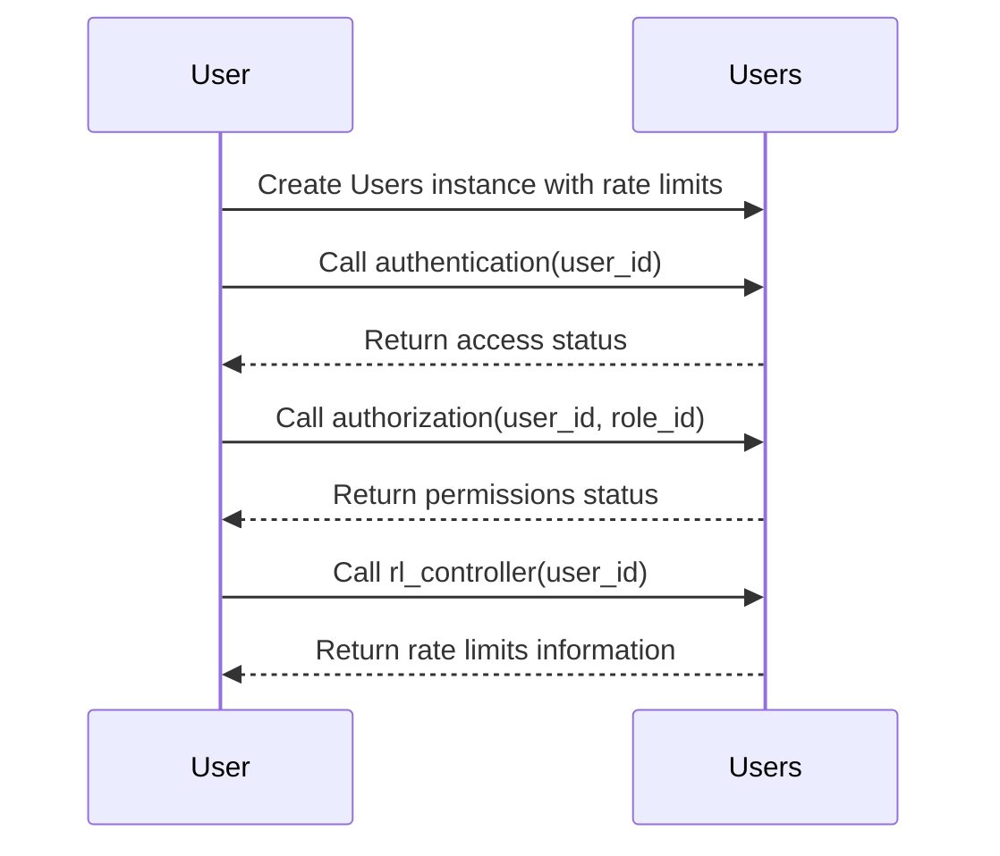

# Users Package
[](https://github.com/obervinov/users-package/actions/workflows/release.yml)
[](https://github.com/obervinov/users-package/actions/workflows/github-code-scanning/codeql)
[](https://github.com/obervinov/users-package/actions/workflows/tests.yml)


##  About this project
**Project Description**

This Python module is created to simplify user management in Telegram bots, providing essential functionality for tasks such as user authentication, authorization, and enforcing speed limits, ensuring efficient management of user attributes and access rights.

**Key Features and Usage**

- Written in Python, this module is designed primarily for Telegram bots but can be adapted for various projects that require user management, role-based access control, and request rate limiting.

- This module requires a dependency in the form of a Vault server for storing user configurations.

- The Vault policy required by the module when interacting with the Vault server can be found [here](tests/vault/policy.hcl) (with a detailed description)

- It includes a `Users` class that provides the following functionalities:

  - **Authentication**: The module allows you to check if a specified user ID has access to the bot.

    - Arguments:
      - `user_id (str)`: The user's ID.

    - Example:
      ```python
      users.authentication(user_id='user1')
      ```

    - Returns:
      - `'allowed'` if access is granted.
      - `'denied'` if access is denied.

  - **Authorization**: You can verify if a user has a specified role.

    - Arguments:
      - `user_id (str)`: The user's ID.
      - `role_id (str)`: The required role ID for the specified user.

    - Example:
      ```python
      users.authorization(user_id='user1', role_id='admin_role')
      ```

    - Returns:
      - `'allowed'` if the user has the role.
      - `'denied'` if the user does not have the role.

  - **Rate Limiting Controller**: This feature tracks user requests and applies rate limits as needed.

    - Arguments:
      - `user_id (str)`: The user's ID.
      - `consider_request (bool)`: Specifies whether the method should include the current request in the request counters.

    - Example:
      ```python
      users.rl_controller(user_id='user1')
      ```

    - Returns:
      - `{'end_time': None}` if no rate limits are applied.
      - `{'end_time': '2023-08-06 11:47:09.440933'}` if rate limits are in effect.


##  Description of class methods
| Method Name | Description | Arguments | Usage Examples | Returns Examples | Configuration Path | History Path |
|-------------|-------------|-----------|----------|----------|---------------------|-----------------------|
| `__init__` | Creates a new Users instance. | `vault (object)`: Vault instance for interacting with the Vault API. `rate_limits (bool)`: Enable the rate limit function. | `Users(vault=vault_client)` | N/A | N/A | N/A |
| `user_access_check` | Main entry point for authentication, authorization, and rate limit verification. | `user_id (str)`: Required user ID. `role_id (str)`: Required role ID for the specified user ID. | `users.user_access_check(user_id='user1', role_id='admin_role')` | `{'access': allowed,'permissions': allowed,'rate_limits': {'end_time': '2023-08-06 11:47:09.440933'}}` | N/A | N/A |
| `authentication` | Checks if the specified user ID has access to the bot. | `user_id (str)`: Required user ID. | `authentication(user_id='user1')` | `allowed` or `denied` | `configuration/users/{user_id}:status` reads configuration in Vault to determine access status. | `data/users/{user_id}:authentication` writes authentication data to Vault. |
| `authorization` | Checks whether the user has the specified role. | `user_id (str)`: Required user ID. `role_id (str)`: Required role ID for the specified user ID. | `authorization(user_id='user1', role_id='admin_role')` | `allowed` or `denied` | `configuration/users/{user_id}:roles` reads configuration in Vault to determine role status. | `data/users/{user_id}:authorization` writes authorization data to Vault. |
| `rl_controller` | Takes into account user requests and applies rate limits as needed. | `user_id (str)`: Required user ID. `consider_request (bool)`: Specifies whether the method should include the current request in the request counters. | `rl_controller(user_id='user1')` | `{'end_time': None}` or `{'end_time': '2023-08-06 11:47:09.440933'}` | `configuration/users/{user_id}:requests` reads configuration and `data/users/{user_id}:requests_counters` reads history counters in Vault. | `data/users/{user_id}:rate_limits` writes rate limit data and `data/users/{user_id}:requests_counters` writes requests counters to Vault. |


##  Structure of configuration and statistics data in vault
This project uses a Vault server with the KV2 engine to store and retrieve configuration data.
It supports user configurations to define system access rights, roles, and request restrictions.

### Users Configuration
- **path to the secret**: `configuration/users/user1`
- **keys and Values**:
  - `status`: The status of user access, which can be either `allowed` or `denied`.
  - `roles`: A list of roles associated with the user, e.g., `['role1', 'role2']`.
  - `requests`: Limits on the number of requests per day, per hour, and a random shift time in minutes. For example:

    ```json
    {
        "requests_per_day": 10,
        "requests_per_hour": 1,
        "random_shift_minutes": 15
    }
    ```

### Users Data and Historical Records
- **path to the secret**: `data/users/user1`
- **keys and values**:
  - `requests_counters`: Historical data with statistics on user requests. It includes counters for the number of requests per day and per hour, e.g.:

    ```json
    {
        "requests_per_day": 9,
        "requests_per_hour": 1
    }
    ```

  - `rate_limits`: Information about rate limits, including the end time of the rate limit. It can have two values:
    - `'end_time'` with a timestamp, e.g., `'end_time': '2023-08-07 10:39:00.000000'`
    - `'end_time'` set to `None` if no rate limits are applied.

  - `authorization`: Details about the authorization process, including the time, status ('allowed' or 'denied'), and the user's role, for example:

    ```json
    {
        "time": "2023-08-07 10:39:00.000000",
        "status": "allowed",
        "role": "role1"
    }
    ```

  - `authentication`: Records of the authentication process, indicating the time and status ('allowed' or 'denied'), like this:

    ```json
    {
        "time": "2023-08-07 10:39:00.000000",
        "status": "allowed"
    }
    ```

##  Installing
```bash
# Install current version
pip3 install git+https://github.com/obervinov/users-package.git#egg=users
# Install version by branch
pip3 install git+https://github.com/obervinov/users-package.git@main#egg=users
# Install version by tag
pip3 install git+https://github.com/obervinov/users-package.git@v2.0.0#egg=users
```

##  Additional usage example
Interaction Model 1: Using a Unified Entrypoint (Method: user_access_check())


Interaction Model 2: Using Separate Methods for Authentication, Authorization, and Rate Limits


Example 1 - With Entrypoint and Rate Limits:
```python
# import module
from users import Users

# create an instance of the class with rate limits
users = Users(vault=vault_client)

# use the main entrypoint
user_info = users.user_access_check(
  user_id=message.chat.id,
  role_id="admin_role"
)
# check permissions, roles, and rate limits
if user_info["access"] == "allowed":
    print("Hi, you can use the bot!")

    if user_info["permissions"] == "allowed":
        if user_info["rate_limits"]["end_time"]:
            print(f"You have sent too many requests, the limit is applied until {user_info['rate_limits']['end_time']}")
        else:
            print("You have admin's rights")
    else:
        print("You do not have access rights to this function")

else:
    print("Access denied, goodbye!")
```

Example 2 - With Entrypoint and Without Rate Limits:
```python
# import module
from users import Users

# create an instance of the class without rate limits
users = Users(
  vault=vault_client,
  rate_limits=False
)

# use the main entrypoint
user_info = users.user_access_check(
  user_id=message.chat.id,
  role_id="admin_role"
)
# check permissions, roles, and rate limits
if user_info["access"] == "allowed":
    print("Hi, you can use the bot!")

    if user_info["permissions"] == "allowed":
        print("You have admin's rights")
    else:
        print("You do not have access rights to this function")

else:
    print("Access denied, goodbye!")
```

Example 3 - Without Entrypoint:
```python
# import module
from users import Users

# create an instance of the class with rate limits
users = Users(vault=vault_client)

# check access to the bot
if users.authentication(user_id='user1') == 'allowed':
    print("You can use this bot")

# check access to the bot
if users.authorization(
  user_id='user1',
  role_id='admin_role'
) == 'allowed':
    print("You have admin's permissions")

# check access to the bot
user_info = users.rl_controller(user_id='user1')
if user_info['rate_limits']['end_time']:
    print(f"You have sent too many requests, the limit is applied until {user_info['rate_limits']['end_time']}")
```


##  GitHub Actions
| Name  | Version |
| ------------------------ | ----------- |
| GitHub Actions Templates | [v1.0.5](https://github.com/obervinov/_templates/tree/v1.0.5) |