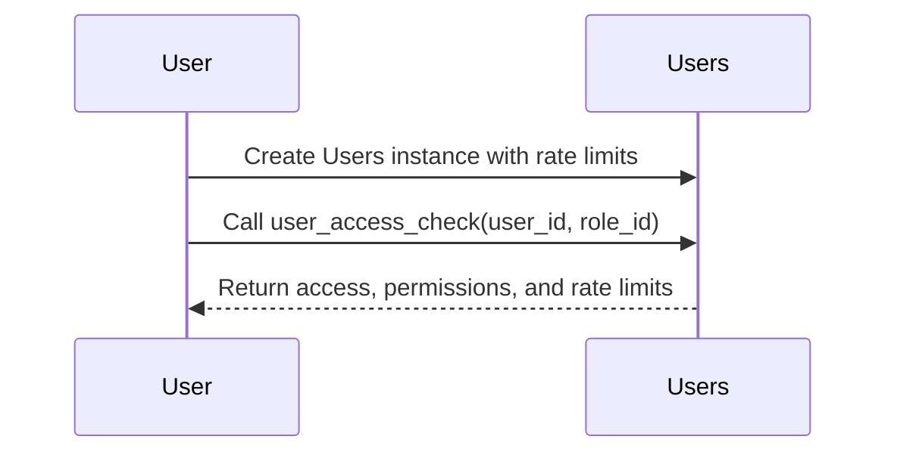
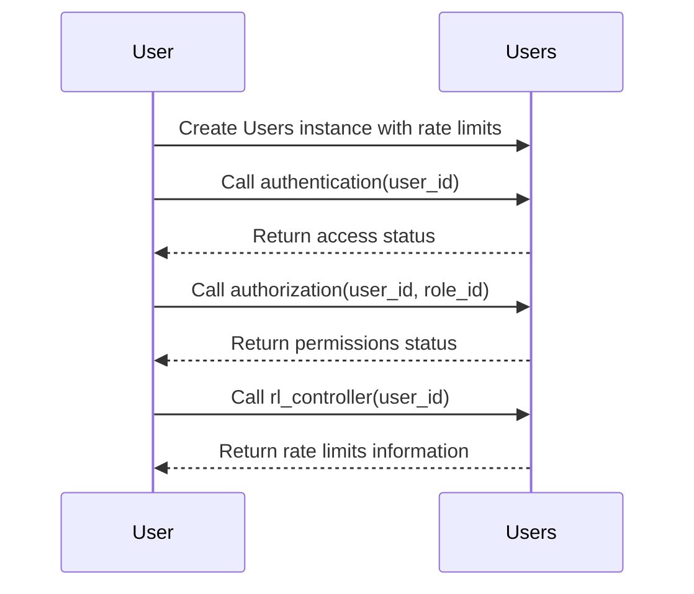

# Users Package
[](https://github.com/obervinov/users-package/actions/workflows/release.yml)
[](https://github.com/obervinov/users-package/actions/workflows/github-code-scanning/codeql)
[](https://github.com/obervinov/users-package/actions/workflows/tests.yml)


##  About this project
**Project Description**

This Python module is designed to simplify user management in Telegram bots, providing the necessary functionality for tasks such as user authentication, authorization and compliance with speed limits, ensuring effective management of user attributes and access rights.

**Key Features**

- This module is designed primarily for Telegram bots but can be adapted for various projects that require user management, role-based access control, and request rate limiting.

- This module requires certain dependencies related to [Vault](https://www.vaultproject.io)
    - [Vault Server](docker-compose.ymla) for storing user configurations and historical data
    - [Additional Module](https://github.com/obervinov/vault-package ) to interact with the Vault API
    - [Vault Policy](tests/vault/policy.hcl) with access rights to the Vault Server

##  Environment variables
| Variable  | Description | Default value |
| ------------- | ------------- | ------------- |
| `VAULT_ADDR`  | The address at which the vault server will be available to the bot | `None` |
| `VAULT_APPROLE_ID` | [Approle id created during vault setup](https://developer.hashicorp.com/vault/docs/auth/approle) | `None` |
| `VAULT_APPROLE_SECRETID`  | [Approle secret id created during vault setup](https://developer.hashicorp.com/vault/docs/auth/approle) | `None` |

##  Description of module Constants

This module contains constant values

| Constant Name       | Description                                       | Default Value   |
|---------------------|---------------------------------------------------|-----------------|
| `VAULT_CONFIG_PATH` | Path for configuration data in Vault.             | `"configuration/users"` |
| `VAULT_DATA_PATH`   | Path for historical data in Vault.                | `"data/users"`  |
| `USER_STATUS_ALLOW` | User access status for allowed access.            | `"allowed"`     |
| `USER_STATUS_DENY`  | User access status for denied access.             | `"denied"`      |


##  Users class
### Class Initialization

This class, `Users`, provides authentication, authorization, and user attribute management for Telegram bots. You can initialize it with various options.

- `vault (any)`: Configuration for initializing the Vault client.
  - `(object) VaultClient instance`: For interacting with the Vault API.
  - `(dict) Configuration`: For initializing a VaultClient instance in this class.

- `rate_limits (bool)`: Enable rate limit functionality.

- **Examples:**

  - Initialize with a VaultClient instance:
    ```python
    users_without_ratelimits = Users(vault=vault_client, rate_limits=False)
    ```

  - Initialize with rate limiting enabled:
    ```python
    users_with_ratelimits = Users(vault=vault_client)
    ```

  - Initialize with a configuration dictionary:
    ```python
    vault_config = {
        "name": "my_project",
        "url": "https://vault.example.com",
        "approle": {
            "id": "my_approle",
            "secret-id": "my_secret"
        }
    }
    users_with_dict_vault = Users(vault=vault_config)
    ```

For more details and examples, see the class docstring.

### User Access Check

The `user_access_check` method is the main entry point for authentication, authorization, and request rate limit verification. It returns a dictionary containing information about access, permissions, and rate limits if applicable.

- **Arguments:**
  - `user_id (str)`: Required user ID.
  - `role_id (str)`: Required role ID for the specified user ID.

- **Examples:**
  ```python
  user_access_check(user_id='user1', role_id='admin_role')
  ```

- **Returns:**
  - A dictionary with access status, permissions, and rate limit information.
    ```
      {
        'access': self.user_status_allow / self.user_status_deny,
        'permissions': self.user_status_allow / self.user_status_deny,
        'rate_limits': {
            'end_time': '2023-08-06 11:47:09.440933'
        }
      }
    ```
For more details, see the method docstring.

### Authentication

The `authentication` method checks if the specified user ID has access to the bot.

- **Arguments:**
  - `user_id (str)`: Required user ID.

- **Example:**
  ```python
  authentication(user_id='user1')
  ```

- **Returns:**
  - `self.user_status_allow` if access is granted.
  - `self.user_status_deny` if access is denied.

### Authorization

The `authorization` method checks whether the user has the specified role.

- **Arguments:**
  - `user_id (str)`: Required user ID.
  - `role_id (str)`: Required role ID for the specified user ID.

- **Example:**
  ```python
  authorization(user_id='user1', role_id='admin_role')
  ```

- **Returns:**
  - `self.user_status_allow` if the user has the role.
  - `self.user_status_deny` if the user does not have the role.


### Description of class attributes
| Data Type | Attribute           | Purpose                                                      | Default Value           |
|-----------|---------------------|--------------------------------------------------------------|-------------------------|
| `object`  | `vault`             | Vault instance for interacting with the Vault API.           | `None`                  |
| `bool`    | `rate_limits`       | Enable request rate limit feature.                           | `True`                  |
| `str`     | `user_status_allow` | User access status: allowed.                                 | `"allowed"`             |
| `str`     | `user_status_deny`  | User access status: denied.                                  | `"denied"`              |
| `str`     | `vault_config_path` | The prefix of the configuration path in the repository.      | `"configuration/users"` |
| `str`     | `vault_data_path`   | The prefix of the path of historical data in the repository. | `"data/users"`          |


## Description of class methods

| Method Name       | Description                                                       | Arguments                                          | Usage Examples                                            | Returns Examples                                      | Configuration Path                                                            | History Path                                                                   |
|-------------------|-------------------------------------------------------------------|---------------------------------------------------|----------------------------------------------------------|--------------------------------------------------------|-----------------------------------------------------------------------------|---------------------------------------------------------------------------------|
| `__init__`        | Creates a new Users instance.                                      | `vault (any)`: Configuration for initializing the Vault client. `rate_limits (bool)`: Enable rate limit functionality. | `Users(vault=vault_client)`                                | N/A                                                    | N/A                                                                         | N/A                                                                             |
| `user_access_check` | Main entry point for authentication, authorization, and rate limit verification. | `user_id (str)`: Required user ID. `role_id (str)`: Required role ID for the specified user ID. | `user_access_check(user_id='user1', role_id='admin_role')` | `{'access': self.user_status_allow, 'permissions': self.user_status_allow, 'rate_limits': {'end_time': '2023-08-06 11:47:09.440933'}}` | N/A                                                                         | N/A                                                                             |
| `authentication`  | Checks if the specified user ID has access to the bot.              | `user_id (str)`: Required user ID.                    | `authentication(user_id='user1')`                         | `self.user_status_allow` or `self.user_status_deny`   | `{self.vault_config_path}/{user_id}:status` reads configuration in Vault to determine access status. | `{self.vault_data_path}/{user_id}:authentication` writes authentication data to Vault. |
| `authorization`   | Checks whether the user ID has the specified role ID.               | `user_id (str)`: Required user ID. `role_id (str)`: Required role ID for the specified user ID. | `authorization(user_id='user1', role_id='admin_role')`    | `self.user_status_allow` or `self.user_status_deny`   | `{self.vault_config_path}/{user_id}:roles` reads configuration in Vault to determine role ID status. | `{self.vault_data_path/{user_id}:authorization` writes authorization data to Vault. |
| `vault`           | Getter for the 'vault' attribute.                                  | N/A                                               | `vault = users_instance.vault`                             | VaultClient instance or None                          | N/A                                                                         | N/A                                                                             |
| `vault`           | Setter for the 'vault' attribute.                                  | `vault (any)`: Configuration for initializing the Vault client. | `users_instance.vault = vault_client`                     | N/A                                                    | N/A                                                                         | N/A                                                                             |
| `user_status_allow` | Getter for the 'user_status_allow' attribute.                      | N/A                                               | `status = users_instance.user_status_allow`                | `str` (User status for allowed access)                  | N/A                                                                         | N/A                                                                             |
| `user_status_allow` | Setter for the 'user_status_allow' attribute.                      | `user_status_allow (str)`: User status for allowed access. | `users_instance.user_status_allow = 'custom_status'`        | N/A                                                    | N/A                                                                         | N/A                                                                             |
| `user_status_deny`  | Getter for the 'user_status_deny' attribute.                       | N/A                                               | `status = users_instance.user_status_deny`                 | `str` (User status for denied access)                   | N/A                                                                         | N/A                                                                             |
| `user_status_deny`  | Setter for the 'user_status_deny' attribute.                       | `user_status_deny (str)`: User status for denied access. | `users_instance.user_status_deny = 'custom_status'`        | N/A                                                    | N/A                                                                         | N/A                                                                             |
| `vault_config_path` | Getter for the 'vault_config_path' attribute.                      | N/A                                               | `path = users_instance.vault_config_path`                   | `str` (Path to the configuration data in Vault)         | N/A                                                                         | N/A                                                                             |
| `vault_config_path` | Setter for the 'vault_config_path' attribute.                      | `vault_config_path (str)`: Path to the configuration data in Vault. | `users_instance.vault_config_path = 'custom_path'`        | N/A                                                    | N/A                                                                         | N/A                                                                             |
| `vault_data_path`   | Getter for the 'vault_data_path' attribute.                        | N/A                                               | `path = users_instance.vault_data_path`                     | `str` (Path to the data in Vault)                       | N/A                                                                         | N/A                                                                             |
| `vault_data_path`   | Setter for the 'vault_data_path' attribute.                        | `vault_data_path (str)`: Path to the data in Vault.      | `users_instance.vault_data_path = 'custom_path'`           | N/A                                                    | N/A                                                                         | N/A                                                                             |


##  RateLimiter class
### Class Initialization

The `RateLimiter` class provides rate limiting functionality for Telegram bot requests. It is used to control the rate at which requests are allowed for a specific user.

- `vault (any)`: Configuration for initializing the Vault client.
  - `(object) VaultClient instance`: For interacting with the Vault API.
  - `(dict) Configuration`: For initializing a VaultClient instance in this class.

- `user_id (str)`: The user ID for which rate limits are applied.

- **Examples:**

  - Initialize with a VaultClient instance and a user ID:
    ```python
    limiter = RateLimiter(vault=vault_client, user_id='User1')
    ```

  - Initialize with a configuration dictionary and a user ID:
    ```python
    vault_config = {
        "name": "my_project",
        "url": "https://vault.example.com",
        "approle": {
            "id": "my_approle",
            "secret-id": "my_secret"
        }
    }
    limiter = RateLimiter(vault=vault_config, user_id='User1')
    ```

For more details and examples, see the class docstring.

### Rate Limit Determination

The `determine_rate_limit` method is used to determine the rate limit status for the user. It returns information about whether rate limits are active or need to be applied.

- **Arguments:**
  - None

- **Examples:**
  ```python
  determine_rate_limit()
  ```

- **Returns:**
  - A dictionary with rate limit information, or `None` if no rate limits are applicable.
    ```python
      (dict | None)
      {"end_time": "2023-08-07 10:39:00.000000"}
    ```
For more details, see the method docstring.

### Active Rate Limit

The `active_rate_limit` method checks and handles active rate limits for the user.

- **Arguments:**
  - None

- **Example:**
  ```python
  active_rate_limit()
  ```

- **Returns:**
  - A dictionary with rate limit information for the user, or `None` if not active.
    ```python
      (dict | None)
      {"end_time": "2023-08-07 10:39:00.000000"}
    ```

### Apply Rate Limit

The `apply_rate_limit` method applies rate limits to the user and updates counters.

- **Arguments:**
  - None

- **Example:**
  ```python
  active_rate_limit()
  ```

- **Returns:**
  - A dictionary with rate limit information for the user, or `None` if not applicable.
    ```python
      (dict | None)
      {"end_time": "2023-08-07 10:39:00.000000"}
    ```

### No Active Rate Limit

The `no_active_rate_limit` method handles the case when no rate limits are applicable.

- **Arguments:**
  - None

- **Example:**
  ```python
  no_active_rate_limit()
  ```

- **Returns:**
  - A dictionary with rate limit information for the user, or `None` if no limits are needed.
    ```python
      (dict)
      {"end_time": None}
    ```

### Description of Class Attributes
| Data Type | Attribute                | Purpose                                                                  | Default Value                   |
|-----------|--------------------------|--------------------------------------------------------------------------|---------------------------------|
| `any`     | `vault`                  | The initialized VaultClient instance or `None` if initialization failed. | N/A                             |
| `str`     | `vault_config_path`      | Path to the configuration data in Vault.                                 | Value from `VAULT_CONFIG_PATH`  |
| `str`     | `vault_data_path`        | Path to the data in Vault.                                               | Value from `VAULT_DATA_PATH`    |
| `dict`    | `requests_configuration` | Configuration for rate limits from Vault.                                | Value from Vault Secret         |
| `dict`    | `requests_counters`      | Counters for user's requests.                                            | Value from Vault Secret         |
| `dict`    | `request_ratelimits`     | Rate limit information for the user.                                     | Value from Vault Secret         |


### Description of Class Methods
| Method Name         | Description                                                        | Arguments                                                                                                           | Usage Examples                                                                | Returns Examples                                                              |
|---------------------|--------------------------------------------------------------------|---------------------------------------------------------------------------------------------------------------------|-------------------------------------------------------------------------------|--------------------------------------------------------------------------------|
| `__init__`          | Creates a new RateLimiter instance.                                 | `vault (any)`: Configuration for initializing the Vault client. `user_id (str)`: The user ID for which rate limits are applied. | `RateLimiter(vault=vault_client, user_id='12345')`                            | N/A                                                                          |
| `vault`             | Getter for the 'vault' attribute.                                  | N/A                                                                                                                 | `vault = limiter.vault`                                                     | VaultClient instance or `None`                                                |
| `vault`             | Setter for the 'vault' attribute.                                  | `vault (any)`: Configuration for initializing the Vault client.                                                   | `limiter.vault = vault_client`                                                | N/A                                                                          |
| `vault_config_path` | Getter for the 'vault_config_path' attribute.                      | N/A                                                                                                                 | `path = limiter.vault_config_path`                                          | `str` (Path to the configuration data in Vault)                                 |
| `vault_config_path` | Setter for the 'vault_config_path' attribute.                      | `vault_config_path (str)`: Path to the configuration data in Vault.                                                  | `limiter.vault_config_path = 'custom_path'`                                | N/A                                                                          |
| `vault_data_path`   | Getter for the 'vault_data_path' attribute.                        | N/A                                                                                                                 | `path = limiter.vault_data_path`                                            | `str` (Path to the data in Vault)                                               |
| `vault_data_path`   | Setter for the 'vault_data_path' attribute.                        | `vault_data_path (str)`: Path to the data in Vault.                                                              | `limiter.vault_data_path = 'custom_path'`                                    | N/A                                                                          |
| `determine_rate_limit` | Determine the rate limit status for the user.                    | N/A                                                                                                                 | `rate_limits = limiter.determine_rate_limit()`                               | `dict` (Rate limit information for the user) or `None`                        |
| `active_rate_limit` | Check and handle active rate limits for the user.                   | N/A                                                                                                                 | `rate_limits = limiter.active_rate_limit()`                                   | `dict` (Rate limit information for the user) or `None`                        |
| `apply_rate_limit`  | Apply rate limits to the user and update counters.                  | N/A                                                                                                                 | `rate_limits = limiter.apply_rate_limit()`                                    | `dict` (Rate limit information for the user) or `None`                        |
| `no_active_rate_limit` | Handle the case when no rate limits are applicable.              | N/A                                                                                                                 | `rate_limits = limiter.no_active_rate_limit()`                               | `dict` (Rate limit information for the user) or `None`                        |


##  Structure of configuration and statistics data in vault
This project uses a Vault server with the KV2 engine to store and retrieve configuration data.
It supports user configurations to define system access rights, roles, and request restrictions.

### Users Configuration
- **path to the secret**: `configuration/users/{user_id}`
- **keys and Values**:
  - `status`: The status of user access, which can be either
      - `self.user_status_allow`
      - `self.user_status_deny`
  - `roles`: A list of roles associated with the user ID, e.g., `['role1', 'role2']`.
  - `requests`: Limits on the number of requests
      - `requests_per_day`
      - `requests_per_hour`
      - `random_shift_time` (additional, random shift in minutes from 0 to the specified number) in minutes

    ```json
    {
        "requests_per_day": 10,
        "requests_per_hour": 1,
        "random_shift_minutes": 15
    }
    ```

- **example of a secret with configuration**:
```json
{
    "status": "allowed",
    "roles": ["admin_role", "additional_role"],
    "requests": {
        "requests_per_day": 10,
        "requests_per_hour": 1,
        "random_shift_minutes": 15
    }
}
```
### Users Data and Historical Records
- **path to the secret**: `data/users/{user_id}`
- **keys and values**:
  - `requests_counters`: Historical data with statistics on user requests. It includes counters for the number of requests
      - `requests_per_day`
      - `requests_per_hour`

    ```json
    {
        "requests_per_day": 9,
        "requests_per_hour": 1
    }
    ```

  - `rate_limits`: Information about rate limits, including the end time of the rate limit. It can have two values:
    - `{'end_time': '2023-08-07 10:39:00.000000'}`
    - `{'end_time': None}`

  - `authorization`: Details about the authorization process, including the time, status
      - `self.user_status_allow`
      - `self.user_status_deny`
      - `role ID`

    ```json
    {
        "time": "2023-08-07 10:39:00.000000",
        "status": "allowed",
        "role": "role1"
    }
    ```

  - `authentication`: Records of the authentication process, indicating the time and status
      - `self.user_status_allow`
      - `self.user_status_deny`

    ```json
    {
        "time": "2023-08-07 10:39:00.000000",
        "status": "allowed"
    }
    ```
- **example of a secret with historical data**:
```json
{
    "requests_counters": {
        "requests_per_day": 9,
        "requests_per_hour": 1
    },
    "rate_limits": { "end_time": "None" },
    "authorization": {
        "time": "2023-08-07 10:39:00.000000",
        "status": "allowed",
        "role": "role1"
    },
    "authentication": {
        "time": "2023-08-07 10:39:00.000000",
        "status": "allowed"
    }
}
```

##  Installing
```bash
# Install current version
pip3 install git+https://github.com/obervinov/users-package.git#egg=users
# Install version by branch
pip3 install git+https://github.com/obervinov/users-package.git@main#egg=users
# Install version by tag
pip3 install git+https://github.com/obervinov/users-package.git@v2.0.0#egg=users
```

##  Additional usage example
Interaction Model 1: Using a Unified Entrypoint (Method: `user_access_check()`)


Interaction Model 2: Using Separate Methods for Authentication, Authorization, and Rate Limits


Example 1 - With Entrypoint and Rate Limits:
```python
# import modules
from vault import VaultClient
from users import Users

# create the vault client
vault_client = VaultClient(
  url='http://0.0.0.0:8200',
  name='mybot1',
  approle={
      'id': id,
      'secret-id': secret-id
  }
)

# create an instance of the class with rate limits
users = Users(vault=vault_client)

# use the main entrypoint
user_info = users.user_access_check(
  user_id=message.chat.id,
  role_id="admin_role"
)
# check permissions, roles, and rate limits
if user_info["access"] == users.user_status_allow:
    print("Hi, you can use the bot!")

    if user_info["permissions"] == users.user_status_allow:
        if user_info["rate_limits"]["end_time"]:
            print(f"You have sent too many requests, the limit is applied until {user_info['rate_limits']['end_time']}")
        else:
            print("You have admin's rights")
    else:
        print("You do not have access rights to this function")

else:
    print("Access denied, goodbye!")
```

Example 2 - With Entrypoint and Without Rate Limits:
```python
# import modules
from vault import VaultClient
from users import Users

# create the vault client
vault_client = VaultClient(
  url='http://0.0.0.0:8200',
  name='mybot1',
  approle={
      'id': id,
      'secret-id': secret-id
  }
)

# create an instance of the class without rate limits
users = Users(
  vault=vault_client,
  rate_limits=False
)

# use the main entrypoint
user_info = users.user_access_check(
  user_id=message.chat.id,
  role_id="admin_role"
)
# check permissions, roles, and rate limits
if user_info["access"] == users.user_status_allow:
    print("Hi, you can use the bot!")

    if user_info["permissions"] == users.user_status_allow:
        print("You have admin's rights")
    else:
        print("You do not have access rights to this function")

else:
    print("Access denied, goodbye!")
```

Example 3 - Without Entrypoint:
```python
# import modules
from vault import VaultClient
from users import Users

# create the vault client
vault_client = VaultClient(
  url='http://0.0.0.0:8200',
  name='mybot1',
  approle={
      'id': id,
      'secret-id': secret-id
  }
)

# create an instance of the class with rate limits
users = Users(vault=vault_client)

# check access to the bot
if users.authentication(user_id='user1') == users.user_status_allow:
    print("You can use this bot")

# check access to the bot
if users.authorization(
  user_id='user1',
  role_id='admin_role'
) == users.user_status_allow:
    print("You have admin's permissions")

# check access to the bot
user_info = users.rl_controller(user_id='user1')
if user_info['rate_limits']['end_time']:
    print(f"You have sent too many requests, the limit is applied until {user_info['rate_limits']['end_time']}")
```


##  GitHub Actions
| Name  | Version |
| ------------------------ | ----------- |
| GitHub Actions Templates | [v1.0.5](https://github.com/obervinov/_templates/tree/v1.0.5) |