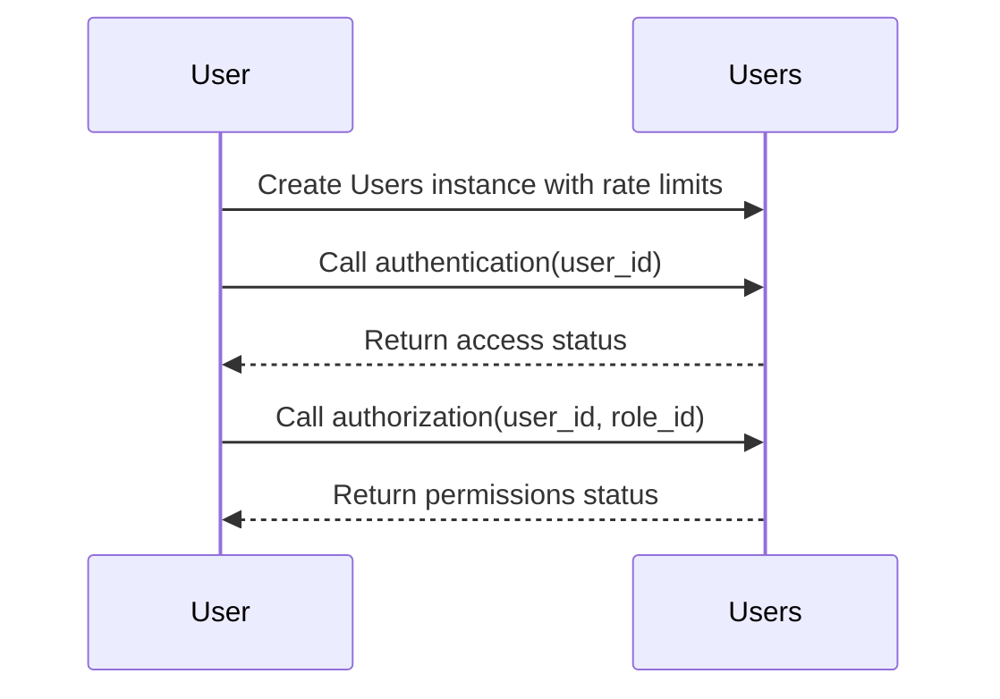
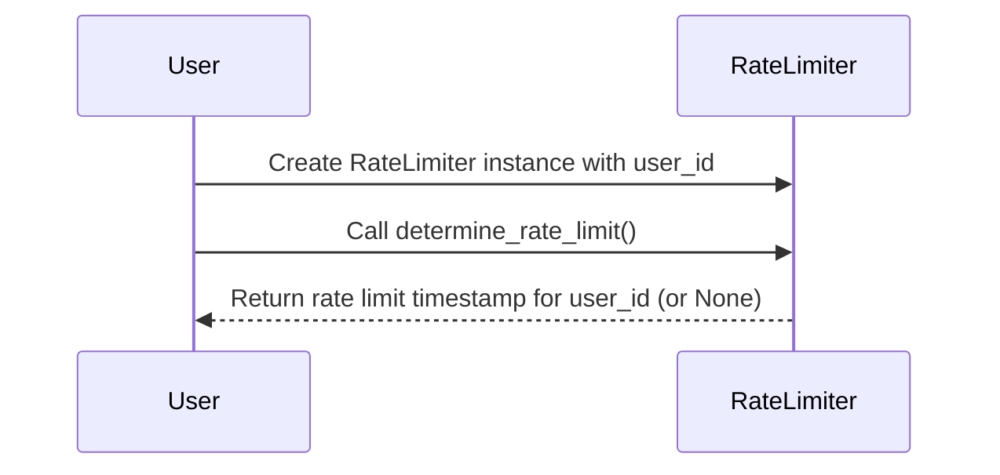

# Users Package
[](https://github.com/obervinov/users-package/actions/workflows/release.yaml)
[](https://github.com/obervinov/users-package/actions/workflows/github-code-scanning/codeql)
[](https://github.com/obervinov/users-package/actions/workflows/pr.yaml)


##  About this project
**Project Description**

This Python module is designed to simplify user management in Telegram bots, providing the necessary functionality for tasks such as user authentication, authorization and compliance with speed limits, ensuring effective management of user attributes and access rights.

**Key Features**

- This module is designed primarily for Telegram bots but can be adapted for various projects that require user management, role-based access control, and request rate limiting.

- This module requires certain dependencies related to [Vault](https://www.vaultproject.io)
    - [Vault Server](docker-compose.ymla) for storing user configurations and historical data
    - [Additional Module](https://github.com/obervinov/vault-package ) to interact with the Vault API
    - [Vault Policy](tests/vault/policy.hcl) with access rights to the Vault Server

##  Description of module Constants

This module contains constant values

| Constant Name       | Description                                       | Default Value   |
|---------------------|---------------------------------------------------|-----------------|
| `VAULT_CONFIG_PATH` | Path for configuration data in Vault.             | `"configuration/users"` |
| `VAULT_DATA_PATH`   | Path for historical data in Vault.                | `"data/users"`  |
| `USER_STATUS_ALLOW` | User access status for allowed access.            | `"allowed"`     |
| `USER_STATUS_DENY`  | User access status for denied access.             | `"denied"`      |


##  Description of module Exceptions
| Exception                    | Describe                              | Usage Example                                    | Tips |
|------------------------------|---------------------------------------|--------------------------------------------------|------|
| `WrongUserConfiguration`     | Raised when user configuration is wrong. | ```python<br>try:<br>    raise WrongUserConfiguration("Incorrect user configuration")<br>except WrongUserConfiguration as e:<br>    print(e)<br>``` | Please, see the configuration example: https://github.com/obervinov/users-package?tab=readme-ov-file#-structure-of-configuration-and-statistics-data-in-vault |
| `VaultInstanceNotSet`        | Raised when the Vault instance is not set. | ```python<br>try:<br>    raise VaultInstanceNotSet("Vault instance not set")<br>except VaultInstanceNotSet as e:<br>    print(e)<br>``` | Please, see documentation for the initialization of the class: https://github.com/obervinov/users-package?tab=readme-ov-file#class-initialization |
| `FailedDeterminateRateLimit` | Raised when the rate limit cannot be determined. | ```python<br>try:<br>    raise FailedDeterminateRateLimit("Failed to determine the rate limit")<br>except FailedDeterminateRateLimit as e:<br>    print(e)<br>``` | Please, check misconfiguration between configuration and historical data in Vault. |


##  Users class
### Class Initialization

The `Users` class provides authentication, authorization and management of user attributes for Telegram bots. You can initialize it using various options

- `vault (any)`: Configuration for initializing the Vault client.
  - `(VaultClient)`: an already initialized instance for interacting with the Vault API.
  - `(dict)`: configuration for initializing a VaultClient instance in this class.

- `rate_limits (bool)`: Enable rate limit functionality.

- **Examples:**

  - Initialize with `VaultClient` and without `rate_limits`:
    ```python
    users_without_ratelimits = Users(vault=vault_client, rate_limits=False)
    ```

  - Initialize with `VaultClient` and with `rate_limits`:
    ```python
    users_with_ratelimits = Users(vault=vault_client)
    ```

  - Initialize with Vault `configuration dictionary`:
    ```python
    vault_config = {
      "name": "my_project",
      "url": "https://vault.example.com",
      "approle": {
          "id": "my_approle",
          "secret-id": "my_secret"
      }
    }
    users_with_dict_vault = Users(vault=vault_config)
    ```

For more details and examples, see the class docstring.

### User Access Check

The `user_access_check` method is the main entry point for authentication, authorization, and request rate limit verification. It is used to control the request rate (limits) for a specific user.

- **Arguments:**
  - `user_id (str)`: Required user ID.
  - `role_id (str)`: Required role ID for the specified user ID.

- **Examples:**
  ```python
  user_access_check(user_id='user1', role_id='admin_role')
  ```

- **Returns:**
  - A dictionary with access status, permissions, and rate limit information.
    ```python
    {
      'access': self.user_status_allow / self.user_status_deny,
      'permissions': self.user_status_allow / self.user_status_deny,
      'rate_limits': {
          'end_time': '2023-08-06 11:47:09.440933'
      }
    }
    ```
For more details, see the method docstring.

### Authentication

The `authentication` method checks if the specified user ID has access to the bot.

- **Arguments:**
  - `user_id (str)`: Required user ID.

- **Example:**
  ```python
  authentication(user_id='user1')
  ```

- **Returns:**
  - `self.user_status_allow` if access is granted.
  - `self.user_status_deny` if access is denied.

### Authorization

The `authorization` method checks whether the user has the specified role.

- **Arguments:**
  - `user_id (str)`: Required user ID.
  - `role_id (str)`: Required role ID for the specified user ID.

- **Example:**
  ```python
  authorization(user_id='user1', role_id='admin_role')
  ```

- **Returns:**
  - `self.user_status_allow` if the user has the role.
  - `self.user_status_deny` if the user does not have the role.


### Description of class attributes
| Data Type | Attribute           | Purpose                                                      | Default Value           |
|-----------|---------------------|--------------------------------------------------------------|-------------------------|
| `object`  | `vault`             | Vault instance for interacting with the Vault API.           | `None`                  |
| `bool`    | `rate_limits`       | Enable request rate limit functionality.                     | `True`                  |
| `str`     | `user_status_allow` | User access status: allowed.                                 | `"allowed"`             |
| `str`     | `user_status_deny`  | User access status: denied.                                  | `"denied"`              |
| `str`     | `vault_config_path` | The prefix of the configuration path in the Vault.           | `"configuration/users"` |
| `str`     | `vault_data_path`   | The prefix of the path of historical data in the Vault.      | `"data/users"`          |


## Description of class methods

| Method Name       | Description                                                       | Arguments                                          | Usage Examples                                            | Returns Examples                                      | Configuration Path                                                            | History Path                                                                   |
|-------------------|-------------------------------------------------------------------|---------------------------------------------------|----------------------------------------------------------|--------------------------------------------------------|-----------------------------------------------------------------------------|---------------------------------------------------------------------------------|
| `__init__`        | Creates a new Users instance.                                      | `vault (any)`: Configuration for initializing the Vault client. `rate_limits (bool)`: Enable rate limit functionality. | `Users(vault=vault_client)`                                | N/A                                                    | N/A                                                                         | N/A                                                                             |
| `user_access_check` | Main entry point for authentication, authorization, and rate limit verification. | `user_id (str)`: Required user ID. `role_id (str)`: Required role ID for the specified user ID. | `user_access_check(user_id='user1', role_id='admin_role')` | `{'access': self.user_status_allow, 'permissions': self.user_status_allow, 'rate_limits': {'end_time': '2023-08-06 11:47:09.440933'}}` | N/A                                                                         | N/A                                                                             |
| `authentication`  | Checks if the specified user ID has access to the bot.              | `user_id (str)`: Required user ID.                    | `authentication(user_id='user1')`                         | `self.user_status_allow` or `self.user_status_deny`   | `{self.vault_config_path}/{user_id}:status` reads configuration in Vault to determine access status. | `{self.vault_data_path}/{user_id}:authentication` writes authentication data to Vault. |
| `authorization`   | Checks whether the user ID has the specified role ID.               | `user_id (str)`: Required user ID. `role_id (str)`: Required role ID for the specified user ID. | `authorization(user_id='user1', role_id='admin_role')`    | `self.user_status_allow` or `self.user_status_deny`   | `{self.vault_config_path}/{user_id}:roles` reads configuration in Vault to determine role ID status. | `{self.vault_data_path/{user_id}:authorization` writes authorization data to Vault. |
| `vault`           | Getter for the 'vault' attribute.                                  | N/A                                               | `vault = users_instance.vault`                             | VaultClient instance or None                          | N/A                                                                         | N/A                                                                             |
| `vault`           | Setter for the 'vault' attribute.                                  | `vault (any)`: Configuration for initializing the Vault client. | `users_instance.vault = vault_client`                     | N/A                                                    | N/A                                                                         | N/A                                                                             |
| `user_status_allow` | Getter for the 'user_status_allow' attribute.                      | N/A                                               | `status = users_instance.user_status_allow`                | `str` (User status for allowed access)                  | N/A                                                                         | N/A                                                                             |
| `user_status_allow` | Setter for the 'user_status_allow' attribute.                      | `user_status_allow (str)`: User status for allowed access. | `users_instance.user_status_allow = 'custom_status'`        | N/A                                                    | N/A                                                                         | N/A                                                                             |
| `user_status_deny`  | Getter for the 'user_status_deny' attribute.                       | N/A                                               | `status = users_instance.user_status_deny`                 | `str` (User status for denied access)                   | N/A                                                                         | N/A                                                                             |
| `user_status_deny`  | Setter for the 'user_status_deny' attribute.                       | `user_status_deny (str)`: User status for denied access. | `users_instance.user_status_deny = 'custom_status'`        | N/A                                                    | N/A                                                                         | N/A                                                                             |
| `vault_config_path` | Getter for the 'vault_config_path' attribute.                      | N/A                                               | `path = users_instance.vault_config_path`                   | `str` (Path to the configuration data in Vault)         | N/A                                                                         | N/A                                                                             |
| `vault_config_path` | Setter for the 'vault_config_path' attribute.                      | `vault_config_path (str)`: Path to the configuration data in Vault. | `users_instance.vault_config_path = 'custom_path'`        | N/A                                                    | N/A                                                                         | N/A                                                                             |
| `vault_data_path`   | Getter for the 'vault_data_path' attribute.                        | N/A                                               | `path = users_instance.vault_data_path`                     | `str` (Path to the data in Vault)                       | N/A                                                                         | N/A                                                                             |
| `vault_data_path`   | Setter for the 'vault_data_path' attribute.                        | `vault_data_path (str)`: Path to the data in Vault.      | `users_instance.vault_data_path = 'custom_path'`           | N/A                                                    | N/A                                                                         | N/A                                                                             |


##  RateLimiter class
### Class Initialization

The `RateLimiter` class provides the speed limit functionality for requests to the Telegram bot in the context of a specific user.

- `vault (any)`: Configuration for initializing the Vault client.
  - `(VaultClient)`: an already initialized instance for interacting with the Vault API.
  - `(dict)`: configuration for initializing a VaultClient instance in this class.

- `user_id (str)`: User ID for checking speed limits.

- **Examples:**

  - Initialize with a `VaultClient` instance:
    ```python
    limiter = RateLimiter(vault=vault_client, user_id='User1')
    ```

  - Initialize with a Vault configuration `dictionary`:
    ```python
    vault_config = {
      "name": "my_project",
      "url": "https://vault.example.com",
      "approle": {
          "id": "my_approle",
          "secret-id": "my_secret"
      }
    }
    limiter = RateLimiter(vault=vault_config, user_id='User1')
    ```

For more details and examples, see the class docstring.

### Rate Limit Determination

The `determine_rate_limit` method is the main entry point for checking restrictions on requests to the bot for the specified user. It returns information about whether the request rate limits are active.
- **Arguments:**
  - None

- **Examples:**
  ```python
  determine_rate_limit()
  ```

- **Returns:**
  - Dictionary with a `timestamp` of the end of restrictions on requests or `None` if rate limit is not applied.
    ```python
    (dict | None)
    {"end_time": "2023-08-07 10:39:00.000000"}
    ```
For more details, see the method docstring.

### Active Rate Limit

The `_active_rate_limit` method is used for a situation when restrictions on requests are already applied and the `user ID` has a `timestamp` of the end of restrictions. The method checks whether it is time to reset the request rate limit.

- **Arguments:**
  - None

- **Example:**
  ```python
  _active_rate_limit()
  ```

- **Returns:**
  - A dictionary with a `timestamp` - if it has not expired yet and the restrictions on requests continue, or `None` - if the time for limiting requests has expired and you need to reset the restrictions.
    ```python
      (dict | None)
      {"end_time": "2023-08-07 10:39:00.000000"}
    ```

### Apply Rate Limit

The `_apply_rate_limit` method is used if the request limit counters is full and it is necessary to apply request limits for the specified user.

- **Arguments:**
  - None

- **Example:**
  ```python
  _apply_rate_limit()
  ```

- **Returns:**
  - Dictionary with the `end time` of restrictions on requests for the specified user.
    ```python
      (dict | None)
      {"end_time": "2023-08-07 10:39:00.000000"}
    ```

### Recalculating request counters from the `requests_history`
The `_update_requests_counters` method recalculates the request counters based on the historical user data (`per_hour` and `per_day`).
- **Arguments:**
  - None

- **Example:**
  ```python
  _update_requests_counters()
  ```

- **Returns:**
  - None

### Consideration of the users requests time
The `_update_requests_history` method added current request timestamp to the requests history list in the Vault.
- **Arguments:**
  - None

- **Example:**
  ```python
  _update_requests_history()
  ```
- **Returns:**
  - None


### Description of Class Attributes
| Data Type | Attribute                | Purpose                                                                  | Default Value                   |
|-----------|--------------------------|--------------------------------------------------------------------------|---------------------------------|
| `any`     | `_vault`                 | The initialized VaultClient instance or `None` if initialization failed. | N/A                             |
| `str`     | `user_id`                | The user ID for which rate limits are applied.                           | N/A                             |
| `str`     | `vault_config_path`      | Path to the configuration data in Vault.                                 | `"configuration/users"`         |
| `str`     | `vault_data_path`        | Path to the data in Vault.                                               | `"data/users"`                  |
| `dict`    | `requests_configuration` | Configuration for rate limits from Vault.                                | Value from Vault Secret         |
| `dict`    | `requests_counters`      | Counters for user's requests.                                            | Value from Vault Secret         |
| `dict`    | `requests_ratelimits`    | Rate limit information for the user.                                     | Value from Vault Secret         |
| `list`    | `requests_history`       | Historical data with timestamps of user requests.                        | Value from Vault Secret         |


### Description of Class Methods
| Method Name       | Description                                                       | Arguments                                          | Usage Examples                                            | Returns Examples                                      | Configuration Path                                                            | History Path                                                                   |
|-------------------|-------------------------------------------------------------------|---------------------------------------------------|----------------------------------------------------------|--------------------------------------------------------|-----------------------------------------------------------------------------|---------------------------------------------------------------------------------|
| `__init__`          | Creates a new RateLimiter instance.                                 | `vault (any)`: Configuration for initializing the Vault client. `user_id (str)`: The user ID for which rate limits are applied. | `RateLimiter(vault=vault_client, user_id='12345')`                            | N/A                                                                          | `{self.vault_config_path}/{user_id}:requests` reads requests configuration in Vault to determine rate limit parameters. | `{self.vault_data_path}/{user_id}:requests_counters` and `{self.vault_data_path}/{user_id}:requests_ratelimits` reads requests historical data in Vault to determine rate limits state. |
| `vault`             | Getter for the 'vault' attribute.                                  | N/A                                                                                                                 | `vault = limiter.vault`                                                     | VaultClient instance or `None`                                                | N/A | N/A |
| `vault`             | Setter for the 'vault' attribute.                                  | `vault (any)`: Configuration for initializing the Vault client.                                                   | `limiter.vault = vault_client`                                                | N/A                                                                          | N/A | N/A |
| `vault_config_path` | Getter for the 'vault_config_path' attribute.                      | N/A                                                                                                                 | `path = limiter.vault_config_path`                                          | `str` (Path to the configuration data in Vault)                                 | N/A | N/A |
| `vault_config_path` | Setter for the 'vault_config_path' attribute.                      | `vault_config_path (str)`: Path to the configuration data in Vault.                                                  | `limiter.vault_config_path = 'custom_path'`                                | N/A                                                                          | N/A | N/A |
| `vault_data_path`   | Getter for the 'vault_data_path' attribute.                        | N/A                                                                                                                 | `path = limiter.vault_data_path`                                            | `str` (Path to the data in Vault)                                               | N/A | N/A |
| `vault_data_path`   | Setter for the 'vault_data_path' attribute.                        | `vault_data_path (str)`: Path to the data in Vault.                                                              | `limiter.vault_data_path = 'custom_path'`                                    | N/A                                                                          | N/A | N/A |
| `determine_rate_limit` | Determine the rate limit status for the specified user ID.                    | N/A                                                                                                                 | `rate_limits = limiter.determine_rate_limit()`                               | `dict` (Rate limit timestamp for the user ID) or `None`                        | N/A | N/A |
| `_active_rate_limit` | Check and handle active rate limits for the user.                   | N/A                                                                                                                 | `rate_limits = limiter._active_rate_limit()`                                   | `dict` (Rate limit timestamp for the user ID) or `None` (if rate limit has been reset)                        | N/A | `{self.vault_data_path}/{user_id}:requests_ratelimits`  writes or delete rate limit timestamp in Vault. | 
| `_apply_rate_limit`  | Apply rate limits to the user ID and reset request counters.                  | N/A                                                                                                                 | `rate_limits = limiter._apply_rate_limit()`                                    | `dict` (Rate limit timestamp for the user ID) or `None`                         | N/A | `{self.vault_data_path}/{user_id}:requests_ratelimits`  writes rate limit timestamp in Vault. | 
| `_update_requests_counters` | Update the request counters based on the historical user data.              | N/A                                                                                                                 | `limiter._update_requests_counters()`                               | `None`                        | N/A | Read `{self.vault_data_path}/{user_id}:requests_history` and updates `{self.vault_data_path}/{user_id}:requests_counters` in the Vault. | N/A |
| `_update_requests_history` | Update the request history based on the user's requests in the Vault.              | N/A                                                                                                                 | `limiter._update_requests_history()`                               | `None`                        | N/A |`{self.vault_data_path}/{user_id}:requests_history` writes current request timestamp to requests list in the Vault. | N/A |


##  Structure of configuration and statistics data in vault
This project uses a Vault server with the KV2 engine to store and retrieve configuration data.
It supports user configurations to define system access rights, roles, and request restrictions.

### Users Configuration
- **path to the secret**: `configuration/users/{user_id}`
- **keys and Values**:
  - `status`: The status of user access, which can be either
      - `self.user_status_allow`
      - `self.user_status_deny`
  - `roles`: A list of roles associated with the user ID, e.g., `["role1", "role2"]`.
  - `requests`: Limits on the number of requests
      - `requests_per_day`
      - `requests_per_hour`
      - `random_shift_time` (additional, random shift in minutes from 0 to the specified number) in minutes

    ```json
    {
      "requests_per_day": 10,
      "requests_per_hour": 1,
      "random_shift_minutes": 15
    }
    ```

- **example of a secret with configuration**:
```json
{
  "status": "allowed",
  "roles": ["admin_role", "additional_role"],
  "requests": {
    "requests_per_day": 10,
    "requests_per_hour": 1,
    "random_shift_minutes": 15
  }
}
```
### Users Data and Historical Records
- **path to the secret**: `data/users/{user_id}`
- **keys and values**:
  - `requests_counters`: Historical data with statistics on user requests. It includes counters for the number of requests
      - `requests_per_day`
      - `requests_per_hour`

      ```json
      {
        "requests_per_day": 9,
        "requests_per_hour": 1
      }
      ```

  - `requests_ratelimits`: Information about rate limits, including the
      - `end_time` of the rate limit
 
      ```json
      {
        "end_time": "2023-08-07 10:39:00.000000"
      }
      ```
      or
      ```json
      {
        "end_time": None
      }
      ```
  - `requests_history`: Historical data with timestamps of user requests
      - `list` of timestamps of user requests
 
      ```json
      [
        "2023-08-07 10:39:00.000000",
        "2023-08-07 10:40:00.000000",
        "2023-08-06 10:00:00.000000"
      ]
      ```
  - `authorization`: Details about the authorization process, including the time, status
      - `timestamp`
      - `self.user_status_allow` or `self.user_status_deny`
      - `role ID`

    ```json
    {
      "time": "2023-08-07 10:39:00.000000",
      "status": "allowed",
      "role": "role1"
    }
    ```

  - `authentication`: Records of the authentication process, indicating the time and status
      - `timestamp`
      - `self.user_status_allow` or `self.user_status_deny`

    ```json
    {
      "time": "2023-08-07 10:39:00.000000",
      "status": "allowed"
    }
    ```
- **example of a secret with historical data**:
    ```json
    "requests_counters": {
      "requests_per_day": 9,
      "requests_per_hour": 1
    }
    ```
    ```json
    "requests_ratelimits": {"end_time": "2023-08-07 10:39:00.000000"}
    ```
    ```json
    "requests_history": [
      "2023-08-07 10:39:00.000000",
      "2023-08-07 10:40:00.000000",
      "2023-08-06 10:00:00.000000"
    ]
    ```
    ```json
    "authorization": {
      "time": "2023-08-07 10:39:00.000000",
      "status": "allowed",
      "role": "role1"
    }
    ```
    ```json
    "authentication": {
      "time": "2023-08-07 10:39:00.000000",
      "status": "allowed"
    }
    ```

##  Additional usage example
Interaction Model 1: Using a Unified Entrypoint (Method: `user_access_check()`)


Interaction Model 2: Using Separate Methods for Authentication, Authorization, and Rate Limits



Example 1 - With Entrypoint and Rate Limits:
```python
# import modules
from vault import VaultClient
from users import Users

# create the vault client
vault_client = VaultClient(
  url='http://0.0.0.0:8200',
  name='mybot1',
  approle={
      'id': id,
      'secret-id': secret-id
  }
)

# create the Users instance of the class with rate limits
users = Users(vault=vault_client)

# use the main entrypoint
user_info = users.user_access_check(
  user_id=message.chat.id,
  role_id="admin_role"
)
# check permissions, roles, and rate limits
if user_info["access"] == users.user_status_allow:
    print("Hi, you can use the bot!")
    if user_info["permissions"] == users.user_status_allow:
        if user_info["rate_limits"]["end_time"]:
            print(f"You have sent too many requests, the limit is applied until {user_info['rate_limits']['end_time']}")
        else:
            print("You have admin's rights")
    else:
        print("You do not have access rights to this function")
else:
    print("Access denied, goodbye!")
```

Example 2 - With Entrypoint and Without Rate Limits:
```python
# import modules
from vault import VaultClient
from users import Users

# create the vault client
vault_client = VaultClient(
  url='http://0.0.0.0:8200',
  name='mybot1',
  approle={
      'id': id,
      'secret-id': secret-id
  }
)

# create the Users instance of the class without rate limits
users = Users(
  vault=vault_client,
  rate_limits=False
)

# use the main entrypoint
user_info = users.user_access_check(
  user_id=message.chat.id,
  role_id="admin_role"
)
# check permissions, roles, and rate limits
if user_info["access"] == users.user_status_allow:
    print("Hi, you can use the bot!")

    if user_info["permissions"] == users.user_status_allow:
        print("You have admin's rights")
    else:
        print("You do not have access rights to this function")

else:
    print("Access denied, goodbye!")
```

Example 3 - Without Entrypoint:
```python
# import modules
from vault import VaultClient
from users import Users

# create the vault client
vault_client = VaultClient(
  url='http://0.0.0.0:8200',
  name='mybot1',
  approle={
      'id': id,
      'secret-id': secret-id
  }
)

# create the Users instance of the class
users = Users(vault=vault_client)

# check access to the bot
if users.authentication(user_id='user1') == users.user_status_allow:
    print("You can use this bot")

# check user role
if users.authorization(
  user_id='user1',
  role_id='admin_role'
) == users.user_status_allow:
    print("You have admin's permissions")

# check rate limit for user_id
limiter = RateLimiter(
  vault=vault_client,
  user_id='user1'
)
if limiter.determine_rate_limit()['end_time']:
    print(f"You have sent too many requests, the limit is applied until {user_info['rate_limits']['end_time']}")
```

##  Installing
```bash
tee -a pyproject.toml <<EOF
[tool.poetry]
name = myproject"
version = "1.0.0"
description = ""

[tool.poetry.dependencies]
python = "^3.10"
users = { git = "https://github.com/obervinov/users-package.git", tag = "v2.0.4" }

[build-system]
requires = ["poetry-core"]
build-backend = "poetry.core.masonry.api"
EOF

poetry install
```

##  GitHub Actions
| Name  | Version |
| ------------------------ | ----------- |
| GitHub Actions Templates | [v1.0.13](https://github.com/obervinov/_templates/tree/v1.0.13) |